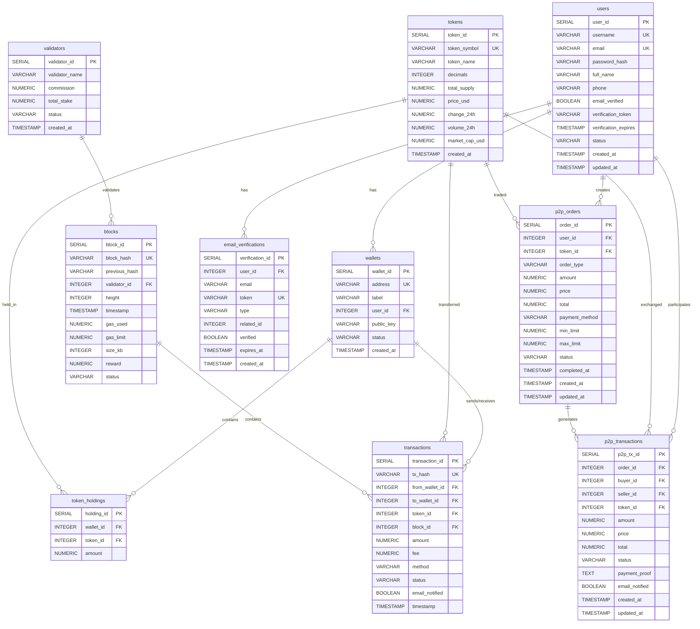

# Database Schema Documentation

Complete SQL schema documentation for Blockchain Explorer database with categorized components and relationship diagrams.

---

## Table of Contents

1. [Database Overview](#database-overview)
2. [Entity Relationship Diagram](#entity-relationship-diagram)
3. [Tables](#tables)
4. [Indexes](#indexes)
5. [Functions](#functions)
6. [Triggers](#triggers)
7. [Views](#views)

---

## Database Overview

**Database Name:** `blockscan`  
**Database System:** PostgreSQL  
**Total Tables:** 10  
**Total Views:** 6  
**Total Functions:** 6  
**Total Triggers:** 5  

---

## Entity Relationship Diagram



---

## Tables

### 1. Users Table

**Purpose:** Stores user account information and authentication data.

```sql
CREATE TABLE IF NOT EXISTS users (
    user_id SERIAL PRIMARY KEY,
    username VARCHAR(100) UNIQUE NOT NULL,
    email VARCHAR(255) UNIQUE NOT NULL,
    password_hash VARCHAR(255) NOT NULL,
    full_name VARCHAR(255),
    phone VARCHAR(20),
    email_verified BOOLEAN DEFAULT FALSE,
    verification_token VARCHAR(255),
    verification_expires TIMESTAMP,
    status VARCHAR(20) DEFAULT 'active',
    created_at TIMESTAMP DEFAULT NOW(),
    updated_at TIMESTAMP DEFAULT NOW()
);
```

**Relationships:**
- One-to-Many with `wallets`
- One-to-Many with `p2p_orders`
- One-to-Many with `p2p_transactions` (as buyer and seller)
- One-to-Many with `email_verifications`

---

### 2. Tokens Table

**Purpose:** Stores cryptocurrency token information and market data.

```sql
CREATE TABLE IF NOT EXISTS tokens (
    token_id SERIAL PRIMARY KEY,
    token_symbol VARCHAR(10) UNIQUE NOT NULL,
    token_name VARCHAR(100) NOT NULL,
    decimals INTEGER DEFAULT 18,
    total_supply NUMERIC(30, 8) DEFAULT 0,
    price_usd NUMERIC(20, 8) DEFAULT 0,
    change_24h NUMERIC(10, 4) DEFAULT 0,
    volume_24h NUMERIC(20, 8) DEFAULT 0,
    market_cap_usd NUMERIC(20, 8) DEFAULT 0,
    created_at TIMESTAMP DEFAULT NOW()
);
```

**Relationships:**
- One-to-Many with `token_holdings`
- One-to-Many with `transactions`
- One-to-Many with `p2p_orders`
- One-to-Many with `p2p_transactions`

---

### 3. Wallets Table

**Purpose:** Stores wallet addresses and associated user information.

```sql
CREATE TABLE IF NOT EXISTS wallets (
    wallet_id SERIAL PRIMARY KEY,
    address VARCHAR(100) UNIQUE NOT NULL,
    label VARCHAR(100),
    user_id INTEGER REFERENCES users(user_id) ON DELETE CASCADE,
    public_key VARCHAR(255),
    status VARCHAR(20) DEFAULT 'active',
    created_at TIMESTAMP DEFAULT NOW()
);
```

**Relationships:**
- Many-to-One with `users`
- One-to-Many with `token_holdings`
- One-to-Many with `transactions` (as from_wallet and to_wallet)

---

### 4. Token Holdings Table

**Purpose:** Junction table storing token balances for each wallet.

```sql
CREATE TABLE IF NOT EXISTS token_holdings (
    holding_id SERIAL PRIMARY KEY,
    wallet_id INTEGER REFERENCES wallets(wallet_id) ON DELETE CASCADE,
    token_id INTEGER REFERENCES tokens(token_id) ON DELETE CASCADE,
    amount NUMERIC(30, 8) DEFAULT 0,
    UNIQUE(wallet_id, token_id)
);
```

**Relationships:**
- Many-to-One with `wallets`
- Many-to-One with `tokens`
- Unique constraint on (wallet_id, token_id)

---

### 5. Validators Table

**Purpose:** Stores blockchain validator information.

```sql
CREATE TABLE IF NOT EXISTS validators (
    validator_id SERIAL PRIMARY KEY,
    validator_name VARCHAR(100) NOT NULL,
    commission NUMERIC(5, 2) DEFAULT 0,
    total_stake NUMERIC(20, 8) DEFAULT 0,
    status VARCHAR(20) DEFAULT 'active',
    created_at TIMESTAMP DEFAULT NOW()
);
```

**Relationships:**
- One-to-Many with `blocks`

---

### 6. Blocks Table

**Purpose:** Stores blockchain block information.

```sql
CREATE TABLE IF NOT EXISTS blocks (
    block_id SERIAL PRIMARY KEY,
    block_hash VARCHAR(100) UNIQUE NOT NULL,
    previous_hash VARCHAR(100),
    validator_id INTEGER REFERENCES validators(validator_id),
    height INTEGER NOT NULL,
    timestamp TIMESTAMP DEFAULT NOW(),
    gas_used NUMERIC(20, 0) DEFAULT 0,
    gas_limit NUMERIC(20, 0) DEFAULT 0,
    size_kb INTEGER DEFAULT 0,
    reward NUMERIC(20, 8) DEFAULT 0,
    status VARCHAR(20) DEFAULT 'finalized'
);
```

**Relationships:**
- Many-to-One with `validators`
- One-to-Many with `transactions`

---

### 7. Transactions Table

**Purpose:** Stores blockchain transaction records.

```sql
CREATE TABLE IF NOT EXISTS transactions (
    transaction_id SERIAL PRIMARY KEY,
    tx_hash VARCHAR(100) UNIQUE NOT NULL,
    from_wallet_id INTEGER REFERENCES wallets(wallet_id),
    to_wallet_id INTEGER REFERENCES wallets(wallet_id),
    token_id INTEGER REFERENCES tokens(token_id),
    block_id INTEGER REFERENCES blocks(block_id),
    amount NUMERIC(30, 8) NOT NULL,
    fee NUMERIC(20, 8) DEFAULT 0,
    method VARCHAR(50) DEFAULT 'transfer',
    status VARCHAR(20) DEFAULT 'pending',
    email_notified BOOLEAN DEFAULT FALSE,
    timestamp TIMESTAMP DEFAULT NOW()
);
```

**Relationships:**
- Many-to-One with `wallets` (from_wallet_id)
- Many-to-One with `wallets` (to_wallet_id)
- Many-to-One with `tokens`
- Many-to-One with `blocks`

---

### 8. P2P Orders Table

**Purpose:** Stores peer-to-peer trading orders (buy/sell).

```sql
CREATE TABLE IF NOT EXISTS p2p_orders (
    order_id SERIAL PRIMARY KEY,
    user_id INTEGER REFERENCES users(user_id) ON DELETE CASCADE,
    token_id INTEGER REFERENCES tokens(token_id),
    order_type VARCHAR(10) NOT NULL CHECK (order_type IN ('buy', 'sell')),
    amount NUMERIC(30, 8) NOT NULL,
    price NUMERIC(20, 8) NOT NULL,
    total NUMERIC(30, 8) NOT NULL,
    payment_method VARCHAR(100),
    min_limit NUMERIC(20, 8),
    max_limit NUMERIC(20, 8),
    status VARCHAR(20) DEFAULT 'active' CHECK (status IN ('active', 'completed', 'cancelled', 'pending')),
    completed_at TIMESTAMP,
    created_at TIMESTAMP DEFAULT NOW(),
    updated_at TIMESTAMP DEFAULT NOW()
);
```

**Relationships:**
- Many-to-One with `users`
- Many-to-One with `tokens`
- One-to-Many with `p2p_transactions`

---

### 9. P2P Transactions Table

**Purpose:** Stores completed P2P transaction records.

```sql
CREATE TABLE IF NOT EXISTS p2p_transactions (
    p2p_tx_id SERIAL PRIMARY KEY,
    order_id INTEGER REFERENCES p2p_orders(order_id) ON DELETE CASCADE,
    buyer_id INTEGER REFERENCES users(user_id),
    seller_id INTEGER REFERENCES users(user_id),
    token_id INTEGER REFERENCES tokens(token_id),
    amount NUMERIC(30, 8) NOT NULL,
    price NUMERIC(20, 8) NOT NULL,
    total NUMERIC(30, 8) NOT NULL,
    status VARCHAR(20) DEFAULT 'pending' CHECK (status IN ('pending', 'paid', 'completed', 'disputed', 'cancelled')),
    payment_proof TEXT,
    email_notified BOOLEAN DEFAULT FALSE,
    created_at TIMESTAMP DEFAULT NOW(),
    updated_at TIMESTAMP DEFAULT NOW()
);
```

**Relationships:**
- Many-to-One with `p2p_orders`
- Many-to-One with `users` (buyer_id)
- Many-to-One with `users` (seller_id)
- Many-to-One with `tokens`

---

### 10. Email Verifications Table

**Purpose:** Stores email verification tokens for various purposes.

```sql
CREATE TABLE IF NOT EXISTS email_verifications (
    verification_id SERIAL PRIMARY KEY,
    user_id INTEGER REFERENCES users(user_id) ON DELETE CASCADE,
    email VARCHAR(255) NOT NULL,
    token VARCHAR(255) UNIQUE NOT NULL,
    type VARCHAR(50) NOT NULL CHECK (type IN ('signup', 'transaction', 'password_reset', 'account_deletion')),
    related_id INTEGER, -- transaction_id or null
    verified BOOLEAN DEFAULT FALSE,
    expires_at TIMESTAMP NOT NULL,
    created_at TIMESTAMP DEFAULT NOW()
);
```

**Relationships:**
- Many-to-One with `users`

---

## Indexes

**Purpose:** Improve query performance on frequently accessed columns.

```sql
-- Wallet indexes
CREATE INDEX IF NOT EXISTS idx_wallets_user_id ON wallets(user_id);
CREATE INDEX IF NOT EXISTS idx_wallets_address ON wallets(address);

-- Token holdings indexes
CREATE INDEX IF NOT EXISTS idx_token_holdings_wallet_id ON token_holdings(wallet_id);
CREATE INDEX IF NOT EXISTS idx_token_holdings_token_id ON token_holdings(token_id);

-- Transaction indexes
CREATE INDEX IF NOT EXISTS idx_transactions_from_wallet ON transactions(from_wallet_id);
CREATE INDEX IF NOT EXISTS idx_transactions_to_wallet ON transactions(to_wallet_id);
CREATE INDEX IF NOT EXISTS idx_transactions_token_id ON transactions(token_id);
CREATE INDEX IF NOT EXISTS idx_transactions_tx_hash ON transactions(tx_hash);

-- P2P order indexes
CREATE INDEX IF NOT EXISTS idx_p2p_orders_user_id ON p2p_orders(user_id);
CREATE INDEX IF NOT EXISTS idx_p2p_orders_status ON p2p_orders(status);
CREATE INDEX IF NOT EXISTS idx_p2p_orders_type ON p2p_orders(order_type);

-- User indexes
CREATE INDEX IF NOT EXISTS idx_users_email ON users(email);

-- Email verification indexes
CREATE INDEX IF NOT EXISTS idx_email_verifications_token ON email_verifications(token);
```

---

## Functions

### 1. Update Updated At Column

**Purpose:** Automatically updates the `updated_at` timestamp when a row is modified.

```sql
CREATE OR REPLACE FUNCTION update_updated_at_column()
RETURNS TRIGGER AS $$
BEGIN
    NEW.updated_at = NOW();
    RETURN NEW;
END;
$$ LANGUAGE plpgsql;
```

**Used by:** Triggers on `users`, `p2p_orders`, and `p2p_transactions` tables.

---

### 2. Get Wallet Balance

**Purpose:** Calculates and returns the balance of a specific token in a wallet.

```sql
CREATE OR REPLACE FUNCTION get_wallet_balance(p_wallet_id INTEGER, p_token_id INTEGER)
RETURNS NUMERIC(30, 8) AS $$
DECLARE
    v_balance NUMERIC(30, 8);
BEGIN
    SELECT COALESCE(amount, 0) INTO v_balance
    FROM token_holdings
    WHERE wallet_id = p_wallet_id AND token_id = p_token_id;
    
    RETURN COALESCE(v_balance, 0);
END;
$$ LANGUAGE plpgsql;
```

**Parameters:**
- `p_wallet_id`: Wallet ID
- `p_token_id`: Token ID

**Returns:** Balance amount (NUMERIC)

**Used by:** `validate_wallet_balance()` function and `check_transaction_balance()` trigger.

---

### 3. Validate Wallet Balance

**Purpose:** Validates if a wallet has sufficient balance for a transaction.

```sql
CREATE OR REPLACE FUNCTION validate_wallet_balance(
    p_wallet_id INTEGER,
    p_token_id INTEGER,
    p_amount NUMERIC(30, 8)
)
RETURNS BOOLEAN AS $$
DECLARE
    v_balance NUMERIC(30, 8);
BEGIN
    v_balance := get_wallet_balance(p_wallet_id, p_token_id);
    RETURN v_balance >= p_amount;
END;
$$ LANGUAGE plpgsql;
```

**Parameters:**
- `p_wallet_id`: Wallet ID
- `p_token_id`: Token ID
- `p_amount`: Required amount

**Returns:** TRUE if sufficient balance, FALSE otherwise

**Used by:** Transaction controller for balance validation.

---

### 4. Get User Statistics

**Purpose:** Returns comprehensive statistics for a user.

```sql
CREATE OR REPLACE FUNCTION get_user_statistics(p_user_id INTEGER)
RETURNS TABLE(
    total_wallets INTEGER,
    total_transactions INTEGER,
    total_p2p_orders INTEGER,
    total_balance_usd NUMERIC(30, 8)
) AS $$
BEGIN
    RETURN QUERY
    SELECT 
        COUNT(DISTINCT w.wallet_id)::INTEGER as total_wallets,
        COUNT(DISTINCT t.transaction_id)::INTEGER as total_transactions,
        COUNT(DISTINCT p.order_id)::INTEGER as total_p2p_orders,
        COALESCE(SUM(th.amount * tok.price_usd), 0) as total_balance_usd
    FROM users u
    LEFT JOIN wallets w ON w.user_id = u.user_id
    LEFT JOIN transactions t ON (t.from_wallet_id = w.wallet_id OR t.to_wallet_id = w.wallet_id)
    LEFT JOIN p2p_orders p ON p.user_id = u.user_id
    LEFT JOIN token_holdings th ON th.wallet_id = w.wallet_id
    LEFT JOIN tokens tok ON tok.token_id = th.token_id
    WHERE u.user_id = p_user_id
    GROUP BY u.user_id;
END;
$$ LANGUAGE plpgsql;
```

**Parameters:**
- `p_user_id`: User ID

**Returns:** Table with user statistics

**Used by:** User controller for profile statistics.

---

### 5. Update Token Volume

**Purpose:** Updates token 24h volume when a transaction is confirmed.

```sql
CREATE OR REPLACE FUNCTION update_token_volume()
RETURNS TRIGGER AS $$
BEGIN
    IF NEW.status = 'confirmed' AND (OLD.status IS NULL OR OLD.status != 'confirmed') THEN
        UPDATE tokens
        SET volume_24h = volume_24h + NEW.amount
        WHERE token_id = NEW.token_id;
    END IF;
    RETURN NEW;
END;
$$ LANGUAGE plpgsql;
```

**Used by:** `trigger_update_token_volume` trigger.

---

### 6. Check Transaction Balance

**Purpose:** Logs a warning if a transaction has insufficient balance (monitoring only).

```sql
CREATE OR REPLACE FUNCTION check_transaction_balance()
RETURNS TRIGGER AS $$
DECLARE
    v_balance NUMERIC(30, 8);
BEGIN
    -- Only check if transaction is being inserted or updated to confirmed
    IF NEW.from_wallet_id IS NOT NULL AND NEW.token_id IS NOT NULL THEN
        v_balance := get_wallet_balance(NEW.from_wallet_id, NEW.token_id);
        
        -- Log warning if balance is insufficient (for monitoring)
        IF v_balance < (NEW.amount + COALESCE(NEW.fee, 0)) THEN
            RAISE WARNING 'Insufficient balance for transaction. Wallet: %, Token: %, Balance: %, Required: %',
                NEW.from_wallet_id, NEW.token_id, v_balance, (NEW.amount + COALESCE(NEW.fee, 0));
        END IF;
    END IF;
    
    RETURN NEW;
END;
$$ LANGUAGE plpgsql;
```

**Used by:** `trigger_check_transaction_balance` trigger.

---

## Triggers

### 1. Update Users Updated At

**Purpose:** Automatically updates `updated_at` when a user record is modified.

```sql
DROP TRIGGER IF EXISTS update_users_updated_at ON users;
CREATE TRIGGER update_users_updated_at
    BEFORE UPDATE ON users
    FOR EACH ROW
    EXECUTE FUNCTION update_updated_at_column();
```

**Table:** `users`  
**Event:** BEFORE UPDATE  
**Function:** `update_updated_at_column()`

---

### 2. Update P2P Orders Updated At

**Purpose:** Automatically updates `updated_at` when a P2P order is modified.

```sql
DROP TRIGGER IF EXISTS update_p2p_orders_updated_at ON p2p_orders;
CREATE TRIGGER update_p2p_orders_updated_at
    BEFORE UPDATE ON p2p_orders
    FOR EACH ROW
    EXECUTE FUNCTION update_updated_at_column();
```

**Table:** `p2p_orders`  
**Event:** BEFORE UPDATE  
**Function:** `update_updated_at_column()`

---

### 3. Update P2P Transactions Updated At

**Purpose:** Automatically updates `updated_at` when a P2P transaction is modified.

```sql
DROP TRIGGER IF EXISTS update_p2p_transactions_updated_at ON p2p_transactions;
CREATE TRIGGER update_p2p_transactions_updated_at
    BEFORE UPDATE ON p2p_transactions
    FOR EACH ROW
    EXECUTE FUNCTION update_updated_at_column();
```

**Table:** `p2p_transactions`  
**Event:** BEFORE UPDATE  
**Function:** `update_updated_at_column()`

---

### 4. Update Token Volume

**Purpose:** Automatically updates token 24h volume when a transaction is confirmed.

```sql
DROP TRIGGER IF EXISTS trigger_update_token_volume ON transactions;
CREATE TRIGGER trigger_update_token_volume
    AFTER INSERT OR UPDATE ON transactions
    FOR EACH ROW
    EXECUTE FUNCTION update_token_volume();
```

**Table:** `transactions`  
**Event:** AFTER INSERT OR UPDATE  
**Function:** `update_token_volume()`

---

### 5. Check Transaction Balance

**Purpose:** Logs warnings for transactions with insufficient balance (monitoring).

```sql
DROP TRIGGER IF EXISTS trigger_check_transaction_balance ON transactions;
CREATE TRIGGER trigger_check_transaction_balance
    BEFORE INSERT OR UPDATE ON transactions
    FOR EACH ROW
    EXECUTE FUNCTION check_transaction_balance();
```

**Table:** `transactions`  
**Event:** BEFORE INSERT OR UPDATE  
**Function:** `check_transaction_balance()`

---

## Views

### 1. Wallet Summary

**Purpose:** Provides comprehensive wallet information with balance summaries.

```sql
CREATE OR REPLACE VIEW wallet_summary AS
SELECT 
    w.wallet_id,
    w.address,
    w.label,
    w.user_id,
    u.username,
    u.email,
    w.status as wallet_status,
    COUNT(DISTINCT th.token_id) as token_count,
    COALESCE(SUM(th.amount), 0) as total_tokens,
    COALESCE(SUM(th.amount * t.price_usd), 0) as total_balance_usd,
    w.created_at
FROM wallets w
LEFT JOIN users u ON u.user_id = w.user_id
LEFT JOIN token_holdings th ON th.wallet_id = w.wallet_id
LEFT JOIN tokens t ON t.token_id = th.token_id
GROUP BY w.wallet_id, w.address, w.label, w.user_id, u.username, u.email, w.status, w.created_at;
```

**Used by:** Wallet controller for wallet listings and details.

---

### 2. Transaction History

**Purpose:** Provides detailed transaction information with wallet and token details.

```sql
CREATE OR REPLACE VIEW transaction_history AS
SELECT 
    t.transaction_id,
    t.tx_hash,
    t.amount,
    t.fee,
    t.method,
    t.status,
    t.timestamp,
    t.email_notified,
    -- From wallet info
    wf.address as from_address,
    wf.label as from_label,
    uf.username as from_username,
    -- To wallet info
    wt.address as to_address,
    wt.label as to_label,
    ut.username as to_username,
    -- Token info
    tok.token_symbol,
    tok.token_name,
    tok.price_usd as token_price,
    -- Block info
    b.block_hash,
    b.height as block_height,
    b.timestamp as block_timestamp
FROM transactions t
LEFT JOIN wallets wf ON wf.wallet_id = t.from_wallet_id
LEFT JOIN users uf ON uf.user_id = wf.user_id
LEFT JOIN wallets wt ON wt.wallet_id = t.to_wallet_id
LEFT JOIN users ut ON ut.user_id = wt.user_id
LEFT JOIN tokens tok ON tok.token_id = t.token_id
LEFT JOIN blocks b ON b.block_id = t.block_id
ORDER BY t.timestamp DESC;
```

**Used by:** Transaction controller for transaction listings and details.

---

### 3. User Statistics

**Purpose:** Provides comprehensive user statistics including wallets, transactions, and balances.

```sql
CREATE OR REPLACE VIEW user_statistics AS
SELECT 
    u.user_id,
    u.username,
    u.email,
    u.status,
    u.email_verified,
    u.created_at,
    COUNT(DISTINCT w.wallet_id) as total_wallets,
    COUNT(DISTINCT CASE WHEN t.from_wallet_id = w.wallet_id OR t.to_wallet_id = w.wallet_id THEN t.transaction_id END) as total_transactions,
    COUNT(DISTINCT p.order_id) as total_p2p_orders,
    COUNT(DISTINCT CASE WHEN p.status = 'active' THEN p.order_id END) as active_p2p_orders,
    COALESCE(SUM(th.amount * tok.price_usd), 0) as total_balance_usd,
    COALESCE(SUM(CASE WHEN th.token_id IS NOT NULL THEN 1 ELSE 0 END), 0) as unique_tokens_held
FROM users u
LEFT JOIN wallets w ON w.user_id = u.user_id
LEFT JOIN transactions t ON (t.from_wallet_id = w.wallet_id OR t.to_wallet_id = w.wallet_id)
LEFT JOIN p2p_orders p ON p.user_id = u.user_id
LEFT JOIN token_holdings th ON th.wallet_id = w.wallet_id
LEFT JOIN tokens tok ON tok.token_id = th.token_id
GROUP BY u.user_id, u.username, u.email, u.status, u.email_verified, u.created_at;
```

**Used by:** User controller for user profile statistics.

---

### 4. Token Market Summary

**Purpose:** Provides comprehensive token market data with holder and transaction counts.

```sql
CREATE OR REPLACE VIEW token_market_summary AS
SELECT 
    tok.token_id,
    tok.token_symbol,
    tok.token_name,
    tok.price_usd,
    tok.change_24h,
    tok.volume_24h,
    tok.market_cap_usd,
    tok.total_supply,
    COUNT(DISTINCT th.wallet_id) as holder_count,
    COUNT(DISTINCT t.transaction_id) as transaction_count,
    COALESCE(SUM(th.amount), 0) as circulating_supply,
    MAX(t.timestamp) as last_transaction_time
FROM tokens tok
LEFT JOIN token_holdings th ON th.token_id = tok.token_id
LEFT JOIN transactions t ON t.token_id = tok.token_id
GROUP BY tok.token_id, tok.token_symbol, tok.token_name, tok.price_usd, 
         tok.change_24h, tok.volume_24h, tok.market_cap_usd, tok.total_supply;
```

**Used by:** Token controller for token listings and market data.

---

### 5. P2P Order Summary

**Purpose:** Provides comprehensive P2P order information with user and token details.

```sql
CREATE OR REPLACE VIEW p2p_order_summary AS
SELECT 
    p.order_id,
    p.user_id,
    u.username,
    u.email,
    tok.token_symbol,
    tok.token_name,
    p.order_type,
    p.amount,
    p.price,
    p.total,
    p.payment_method,
    p.min_limit,
    p.max_limit,
    p.status,
    p.created_at,
    p.updated_at,
    p.completed_at,
    COUNT(DISTINCT pt.p2p_tx_id) as transaction_count
FROM p2p_orders p
LEFT JOIN users u ON u.user_id = p.user_id
LEFT JOIN tokens tok ON tok.token_id = p.token_id
LEFT JOIN p2p_transactions pt ON pt.order_id = p.order_id
GROUP BY p.order_id, p.user_id, u.username, u.email, tok.token_symbol, tok.token_name,
         p.order_type, p.amount, p.price, p.total, p.payment_method, p.min_limit,
         p.max_limit, p.status, p.created_at, p.updated_at, p.completed_at;
```

**Used by:** P2P controller for order listings and details.

---

### 6. Block Summary

**Purpose:** Provides comprehensive block information with transaction counts and totals.

```sql
CREATE OR REPLACE VIEW block_summary AS
SELECT 
    b.block_id,
    b.block_hash,
    b.previous_hash,
    b.height,
    b.timestamp,
    b.gas_used,
    b.gas_limit,
    b.size_kb,
    b.reward,
    b.status,
    v.validator_name,
    v.commission,
    COUNT(DISTINCT t.transaction_id) as transaction_count,
    COALESCE(SUM(t.amount), 0) as total_transaction_amount,
    COALESCE(SUM(t.fee), 0) as total_fees
FROM blocks b
LEFT JOIN validators v ON v.validator_id = b.validator_id
LEFT JOIN transactions t ON t.block_id = b.block_id
GROUP BY b.block_id, b.block_hash, b.previous_hash, b.height, b.timestamp,
         b.gas_used, b.gas_limit, b.size_kb, b.reward, b.status,
         v.validator_name, v.commission
ORDER BY b.height DESC;
```

**Used by:** Block controller for block listings and details.

---

## Table Relationship Diagram


---

## Summary Statistics

- **Total Tables:** 10
- **Total Indexes:** 14
- **Total Functions:** 6
- **Total Triggers:** 5
- **Total Views:** 6
- **Foreign Key Relationships:** 15
- **Unique Constraints:** 4
- **Check Constraints:** 3

---

## Notes

1. All foreign keys use appropriate CASCADE or RESTRICT behaviors
2. Timestamps are automatically managed with DEFAULT NOW()
3. Triggers ensure data consistency and automatic updates
4. Views provide optimized query paths for common operations
5. Indexes are strategically placed on frequently queried columns
6. Functions encapsulate business logic for reusability

---

*Last Updated: 2024*

